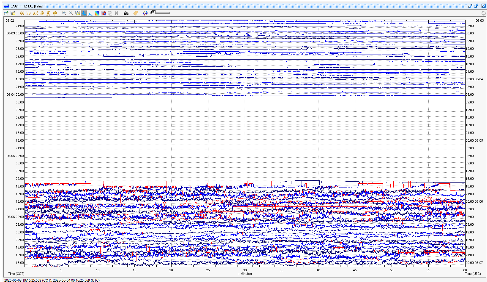
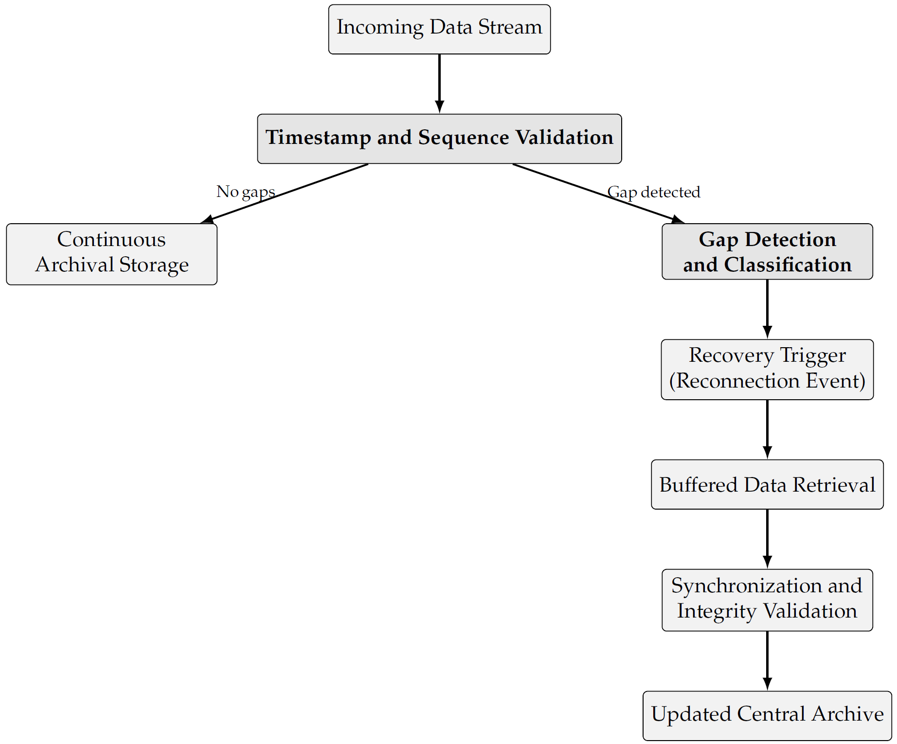

# PRT-Recovery-Seismic-Data-System-
PRT is a lightweight tool for recovering seismic data gaps in seismic-volcanic monitoring networks. The analysis is performed on real data obtained from the DataCenter and monitoring stations of the Geophysical Institute of the National Polytechnic School. IG-EPN, Ecuador.

As shown in the figure, a long single gap of SAG1 presents a continuous but extensive gap of 01d 09h 24m, resulting in Apre = 65.21%. The figure illustrates the pre-recovery waveform availability at SAG1 and visually identifies the start/end of the gap. For this station, the primary target streams for continuity correspond to the three-component velocity channels (HHZ/HHN/HHE) and the infrasound channel (BDF), which are relevant for event analysis and multi-parameter correlation during the selected window.

  

The workflow describes how incoming data streams are first validated for timestamps and sequences to ensure temporal continuity. When no discontinuities are detected, data are written to the archive continuously. If a temporal gap is identified, the system classifies the discontinuity and activates the -PRT- recovery mechanism upon reconnection. During this phase, buffered waveform segments stored at the station or datalogger level are retrieved and reintegrated into the archive. A synchronization and integrity validation step ensures that recovered records are chronologically consistent and free of duplication before updating the central archive. This design minimizes data loss while maintaining operational efficiency and archive consistency.

  

## 1. Dependency

The algorithm was tested with:

Operating System:   Ubuntu 24.04 LTS  / Windows 11
Architecture:       x86_64

Python Dependencies
| Package         | Version        |
|-----------------|----------------|
| Python          | 3.8.3          |
| fonttools       | 4.44.0         |
| ipython         | 8.12.3         |
| jupyter_client  | 8.6.0          |
| jupyter_core    | 5.5.0          |
| matplotlib      | 3.7.3          |
| matplotlib-inline | 0.1.6        |
| numpy           | 1.24.4         |
| scikit-learn    | 1.3.2          |
| seaborn         | 0.13.2         |
| obspy           | 1.4.2          |
| datetime        | 3.10.11        |

## 2. Cite
Santiago Arrais, Carolina Tripp-Barba , Nathaly Orozco Garzón,∗ , Pablo Barbecho , Xavier Calderón Hinojosa and Luis Urquiza-Aguiar. A Lightweight Python Recovery Tool for Waveform Gap Recovery in Seismic–Volcanic Monitoring Networks. (2026)

